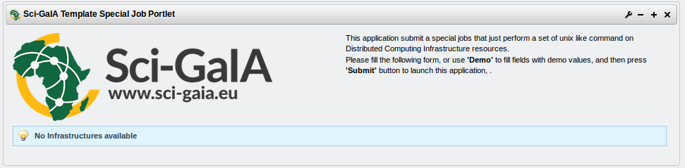
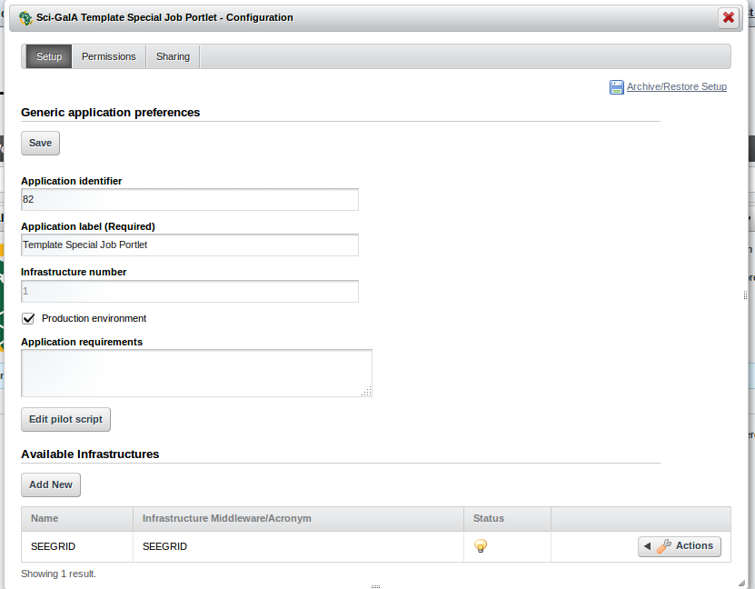
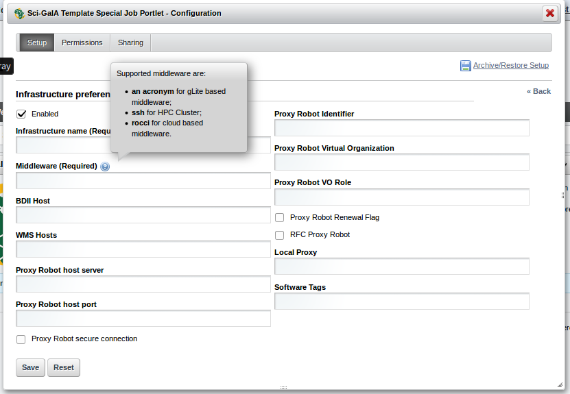
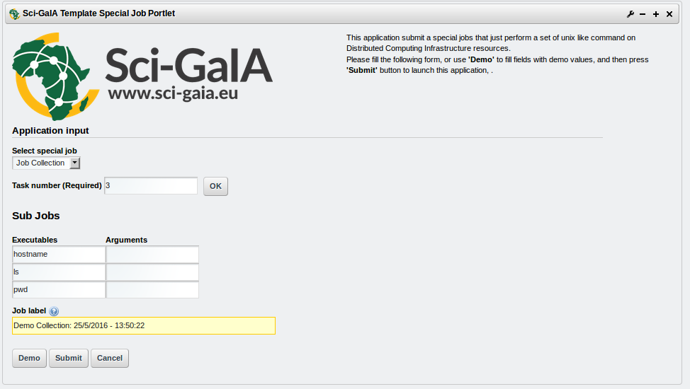

*********************************
TEMPLATE SPECIAL JOB PORTLET
*********************************

.. sidebar:: Version Available 1.0
    :subtitle: Template Special Job Portlet

    - Liferay 6.1.1 (`link <https://sourceforge.net/projects/lportal/files/Liferay%20Portal/6.1.1%20GA2/>`_)
    - Catania Grid & Cloud Engine 1.5.11 or above (`link <http://grid.ct.infn.it/csgf/binaries/GridEngine/>`_)

============
About
============

The **template-special-job-portlet** consists of a portlet example able to submit
special jobs towards different kinds of *Distributed Computing Infrastructures*
(**DCIs**). This portlet template contains the relevant elements needed to deal
with DCIs, it has been developed in the contest of the `Sci-GaIA <http://www.sci-gaia.eu/>`_  project
to support the application development process during the `Sci-GaIA Winter School
<http://courses.sci-gaia.eu/courses/UNICT/WS2015/201603_01_31/about>`_
The aim of the **template-special-job-portlet** is to provide an application template that
Science Gateway developers can customize to fit their own specific requirements.
To make easier the customization process, a *customize.sh* bash script is included
inside the source code package.

The **template-special-job-portlet** handles three different kinds of special jobs, a user
can choose among:

1. **Job Collection**: is a simple parallel application that spawns N sub-jobs; when all these are successfully  completed the whole collection becomes DONE.

2. **Workflow N1**: is a parallel application that spawns N sub-jobs, waits until all these are correcly completed and then submits a new job whose input files are the outputs of the N sub-jobs. When also this `"final job"` is successfully executed, the whole Workflow N1 becomes DONE.

3. **Job Parametric**: is a parallel application that spawns N sub-jobs with the same executable and wi

============
Installation
============

This section explains how to deploy and configure the **template-special-job-portlet**.

1. Move into your Liferay plugin SDK portlets folder and clone the template-special-job-portlet
source code through the git clone command:

.. code:: bash

        git clone https://github.com/csgf/template-special-job-portlet.git

2. Now, move into the just created portlet folder and execute the deploy
command:

.. code:: bash

        ant deploy

When the previous command has completed, verify that the portlet was *"Successfully
autodeployed"*, look for a string like this in the Liferay log
file under ``$LIFERAY_HOME/glassfish-3.1.2/domains/domain1/logs/server.log``.

3. Then, open your browser and point at your Science Gateway instance and form
there click Add > More in the ``Sci-GaIA`` category, click on Add button to
add this new portlet. Following picture shows the correctly result:

As soon as the portlet has been successfully deployed you have to configure it using
the portlet configuration menu. Portlet configuration is splitted in two parts:
*Generic application preferences*, *Infrastructures preferences*.

Generic application preferences
~~~~~~~~~~~~~~~~~~~~~~~~~~~~~~~

The generic part contains:

* **Application Identifier** the identifier assigned to tha application in the GridInteractions database table.
* **Application label** *(Required)* a short meaningful label for the application.
* **Production environment** a boolean flag that specify if the portlet will be used in a production or development environment.

  * if *true* the development environment preferences will be shown
      * **UserTrackingDB hostname** hostname of the Grid and Cloud Engine Usertracking database. Usually *localhost*
      * **UserTrackingDB username** username of the Grid and Cloud Engine Usertracking database user. Usually *user_tracking*
      * **UserTrackingDB password** password specified for the Usertracking database user. Usually *usertracking*
      * **UserTrackingDB database** Grid and Cloud Engine Usertracking database name. Usually *userstracking*
* **Application requirements** the necessary statements to specify a job execution requirement, such as a particular software, a particular number of CPUs/RAM, etc. defined using JDL format.

.. note:: You can get the *Application Idetifier* inserting a new entry into the **GridOperations** table:

    .. code:: sql

        INSERT INTO GridOperation VALUES ('<portal name>' ,'Template Special Job Portlet');
          -- portal name: is a label representing the portal name, you can get the
          -- right value from your Science Gateway istance.

Infrastructure preferences
~~~~~~~~~~~~~~~~~~~~~~~~~~~~~~~

The infrastructure preferences section shows the e-Infrastructures configured.
Using the actions menu on the right side of the table, you can:

* Activate / Deactivate
* Edit
* Delete

an available infrastructure.
The *Add New* button is meant to add a new infrastructure available to the application.
When you click this button a new panel, will be shown with several fields where
you can specify the Infrastructure details.

The fields belonging to this panel are:

* **Enabled** A boolean which enable or disable the current infrastructure.
* **Infrastructure Name** *(Required)* The infrastructure name for these settings.
* **Middleware** *(Required)* The middleware used by the current infrastructure. Here you can specify 3 different values.

  * **an acronym** for gLite based middleware.
  * **ssh** for HPC Cluster.
  * **rocci** for cloud based middleware.

Following fields will be traslated in the relevant infrastructure parameters based on the value specified in this field.

* **BDII host**: The Infrastructure information system endpoint (URL).

  * If Middleware is **ssh** here you can specify a ";" separated string with ssh authentications parameters (username;password or username for key based authentication).
  * If Middleware is **rocci** here you can specify the name of the compute resource that will be created.

* **WMS host**: is the service endpoint (URL).
* **Robot Proxy host server**: the robot proxy server hostname.
* **Robot Proxy host port**: the robot proxy server port.
* **Proxy Robot secure connection**: a boolean to specify if robot proxy server needed a SSL connection.
* **Robot Proxy identifier**: the robot proxy identifier.
* **Proxy Robot Virtual Organization**: the virtual organization configured.
* **Proxy Robot VO Role**: the role virtual organization configured.
* **Proxy Robot Renewal Flag**: a boolean to specify if robot proxy can be renewed before its expiration.
* **RFC Proxy Robot**: a boolean to specify if robot proxy must be RFC.

  * If Middleware is **rocci** this field must be checked.

* **Local Proxy**: the path of a local proxy if you want use this type of authentication.
* **Software Tags**: infrastructure specific information.

  * If Middleware is **rocci** here you can specify a ";" separated string with ``<image_id>;<flavor>;<link_resource>``

============
Usage
============

The usage of the template-special-job-portlet is really simple. The user has to specify the task number
he wants like to perform, then he has to specify which kind of special job he wants
execute from the provided combobox, then clicking on the *OK* button the interface will
be automatically updated to show a set of input fiels that the user should fill
with a unix like command and the arguments. futhermore the aèèlication provide a
*Demo* button that allows to the user to submit a preconfigured *Job  Collection*
cosist of 3 sub-jobs.

Optionally the user can specify also a **job label**, that is a human readable label,
used to idetify the job execution on DCIs, if he doesn't specify any label
a default one will be created with the username and a timestamp.

==============
Contributor(s)
==============

If you have any questions or comments, please feel free to contact us using the
Sci-GaIA project dicussion forum (`discourse.sci-gaia.eu <http://discourse.sci-gaia.eu>`_)

.. _CSIR: http://www.csir.co.za/
.. _DFA: http://www.dfa.unict.it/

:Authors:
 Roberto BARBERA - University of Catania (DFA_),

 Bruce BECKER    - Council for Scientific and Industrial Research (CSIR_),

 Mario TORRISI   - University of Catania (DFA_)
